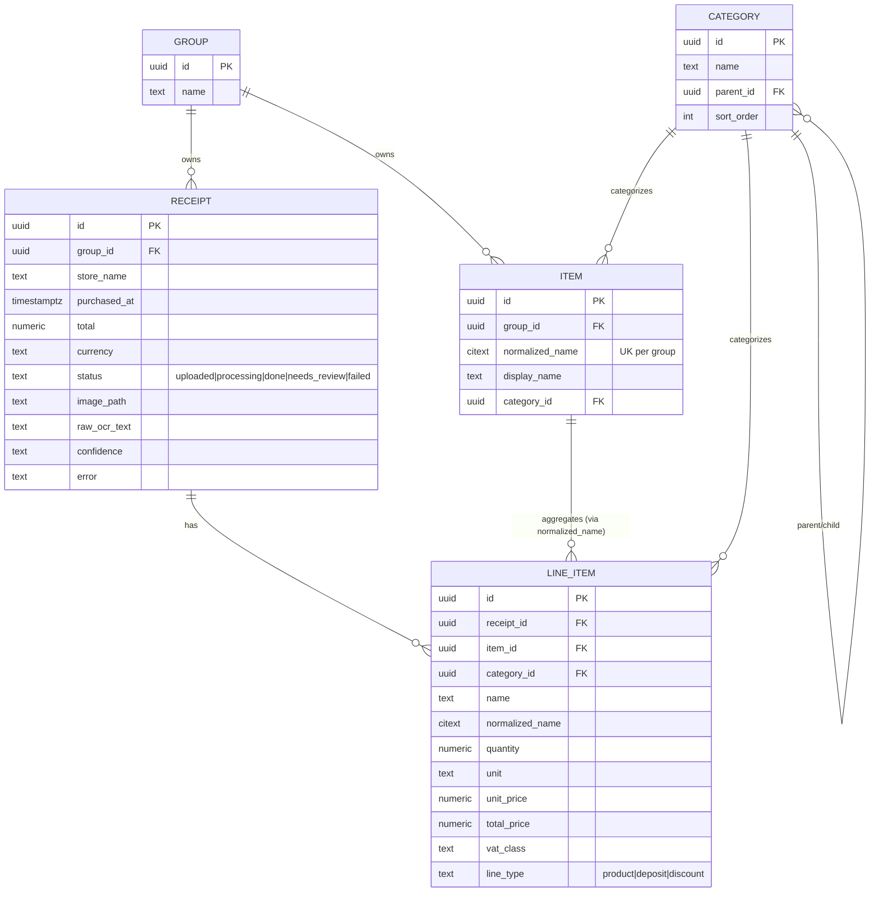
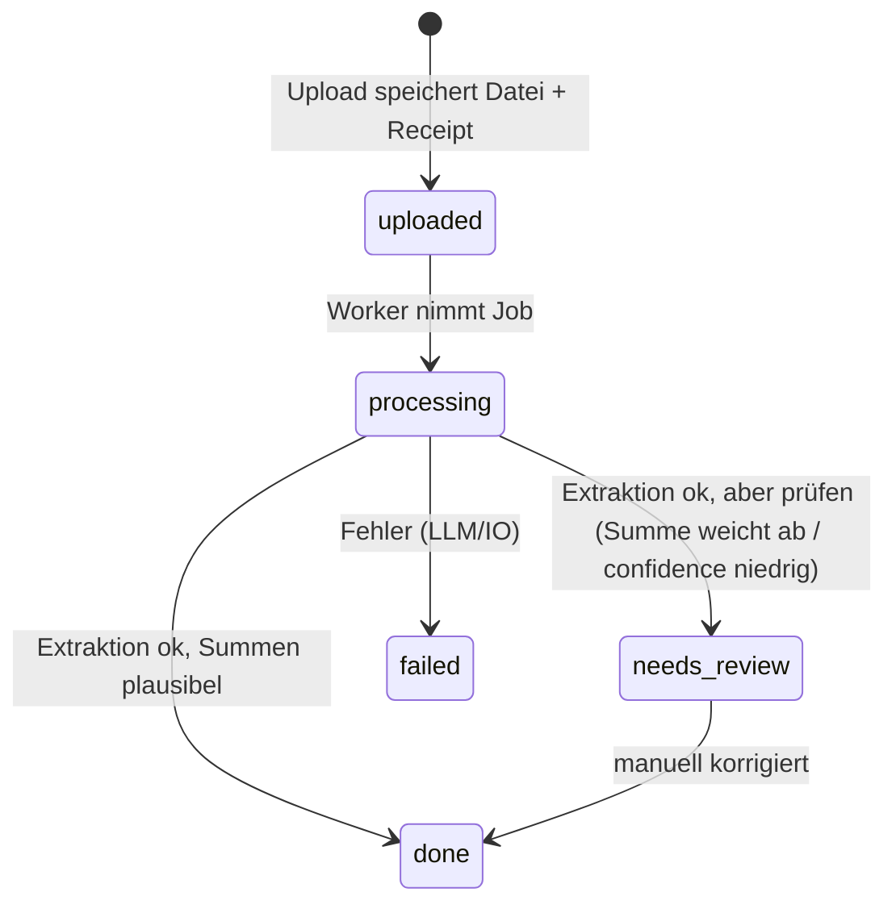

# Architektur

Quelle der Wahrheit für das *Wie*. Wer Datenmodell, Hintergrundjobs oder eine
Architekturentscheidung ändert, pflegt diese Datei in derselben Änderung.

## 1. Überblick

- **Backend:** FastAPI, SQLAlchemy 2 (async), PostgreSQL 16, Alembic. Async
  Extraktion über einen ARQ-Worker + Redis (ab Phase 2).
- **Frontend:** Nuxt 3 SPA (`ssr: false`), TypeScript strict, Pinia, Tailwind, PWA.
- **LLM:** provider-agnostischer Adapter (`integrations/llm/`), Default
  OpenAI-Vision-kompatibel, umschaltbar auf Ollama per ENV.
- **Betrieb:** docker-compose (db, redis, backend, worker, frontend).

### 1.1 Schichten & die eine harte Regel

`domain/` importiert **nichts** aus `services/`, `integrations/` oder `api/`.
Es ist reine, synchrone, I/O-freie Logik (Normalisierung, später Aggregation)
und dort konzentrieren sich die Unit-Tests. Alles mit DB-, Netz- oder
Redis-Zugriff gehört in `services/` bzw. `integrations/`.

`services/` orchestriert Use-Cases. `integrations/` kapselt jede Außenwelt
hinter einem Interface, damit Anbieter austauschbar bleiben (LLM: openai /
ollama / null-Fallback; Storage).

## 2. Datenmodell

UUID-v7-Primärschlüssel (zeitlich sortiert), `created_at`/`updated_at` per
Mixin. Geldbeträge als `Numeric` (keine Floats). Enums als Text-Spalte mit
`CHECK`-Constraint. Produktnamen für den Abgleich als `CITEXT`.

`Receipt` und `Item` gehören einer `GROUP` (Haushalt) — die Tenancy-Grenze
(siehe §6). `Category` ist geteilte Stammdaten (global). `LineItem` erbt die
Gruppe über sein `Receipt`.

### 2.1 Receipt-Statusfluss

Das Frontend pollt den Receipt (~2 s), bis `processing` verlassen ist
(Entscheidung: Polling statt WebSocket — das Backend bleibt zustandslos).

### 2.2 Normalisierung (`domain/normalize.py`)

Der Schlüssel für Vergleichbarkeit über Bons und Zeit: `normalize_name`
faltet Groß/Klein, Umlaute/ß, Akzente, Dezimal-Komma und Satzzeichen zu einem
stabilen Key. „H-Milch 3,5%", „H MILCH 3.5" und „h.milch 3,5 %" ergeben denselben
`normalized_name`. `LineItem.normalized_name` und `Item.normalized_name` nutzen
dieselbe Funktion; darüber mappen Positionen auf das `Item`-Stammdatum für
Trends. Bewusst einfach — ein klügerer Matcher kann später aufsetzen, ohne den
Vertrag zu ändern.

## 3. Extraktions-Pipeline (Phase 2, implementiert)

1. `POST /api/v1/receipts` validiert Größe (`UPLOAD_MAX_BYTES`) und Typ per
   **Magic-Bytes** (`domain/upload.detect_media_type`, nicht dem
   Client-Content-Type vertrauend), speichert die Datei unter einem
   server-generierten Namen (`integrations/storage/local`) und legt `Receipt`
   mit `status=uploaded` an.
2. Die Extraktion wird eingeplant: bevorzugt als **ARQ-Job**
   (`workers/tasks.extract_receipt_task`); ist kein Redis/Worker verfügbar,
   fällt der Endpoint auf **FastAPI BackgroundTasks** zurück (beides laut Brief
   erlaubt). Der Job setzt `status=processing`.
3. `services/extraction_service` liest die Datei (PDF → erstes eingebettetes
   Bild via `integrations/storage/pdf`), schickt sie über den Vision-Adapter
   (`integrations/llm`) mit dem Prompt aus `prompts/receipt_extraction.de.txt`
   und übergibt die rohe Antwort dem **reinen** Parser
   (`domain/extraction.parse_receipt_json`).
4. Ergebnis → `Receipt` + `LineItem`s; Produkt-Positionen bekommen
   `normalized_name` und werden pro Gruppe auf `Item` gemappt (Trend-Anker),
   Deposit/Discount bleiben receipt-lokal. `domain/extraction.reconcile_confidence`
   vergleicht die Positionssumme mit `total`: passt sie → `status=done`, sonst
   (oder bei `confidence=low` / keinen Positionen) → `needs_review`.
5. Jeder Fehler wird als `status=failed` mit `error` festgehalten (ein defekter
   Bon legt den Worker nicht lahm). `LLM_PROVIDER=none` (kein Modell) →
   `raw=None` → `needs_review` (manuelle Erfassung). Jeder LLM-Pfad degradiert
   sauber auf den No-op-Fallback.

Das Frontend (`pages/upload.vue` + `composables/useReceiptPolling`) pollt nach
dem Upload `GET /api/v1/receipts/{id}` (~2 s), bis ein Endzustand erreicht ist.

## 4. Analyse-Ebene (Phase 4, das Herzstück)

Aggregations-Queries + Endpoints (Details siehe
[Anforderungen](anforderungen.md)): Monatsbericht, „zu viel gekauft", „teure
Lebensmittel", Preistrend pro Artikel, Vormonatsvergleich. Die reine
Aggregationslogik lebt in `domain/` und ist der Testschwerpunkt.

## 5. Offene Entscheidungen

- Auth: noch nicht implementiert (privates Homelab). Magic-Link-Login (an
  cooking-jonelli orientiert) ist als späterer Baustein vorgesehen und greift
  in denselben Tenancy-Seam wie unten.
- Kategorie-Hierarchie: aktuell zweistufig geseedet (Top-Level = die vom Prompt
  vergebenen Kategorien, plus einige Unterkategorien). Tiefe bleibt offen.

## 6. Tenancy / Gruppen

Wie cooking-jonelli ist die **Gruppe (Haushalt)** die Besitz- und
Mandantengrenze. Damit die spätere Einführung echter Mehr-Gruppen-Unterstützung
**keine Schema-Migration + Daten-Backfill** wird, ist die Tenancy schon jetzt
eingebaut:

- `groups`-Tabelle (vorerst minimal: `id`, `name`).
- `receipts.group_id` und `items.group_id` (NOT NULL, `ON DELETE CASCADE`);
  `items` sind **pro Gruppe** eindeutig (`unique(group_id, normalized_name)`) —
  jeder Haushalt hat seinen eigenen Produktkatalog / Preisverlauf.
- Beim Start wird eine **Default-Gruppe** gebootstrappt
  (`DEFAULT_GROUP_NAME`, `services/group_service.ensure_default_group`).
- Der einzige Tenancy-Seam ist `api/deps.get_current_group_id`: heute liefert er
  die Default-Gruppe, mit Auth später die aktive Mitgliedschaft des Users — die
  Endpoints hängen unverändert daran.

Was später dazukommt: Auth + `users` + Mitgliedschaftstabelle (Rollen),
Ableitung der Gruppe aus dem Login. `Category` bleibt geteilte Stammdaten;
gruppen­spezifische Kategorien könnten optional über ein Override ergänzt werden.
