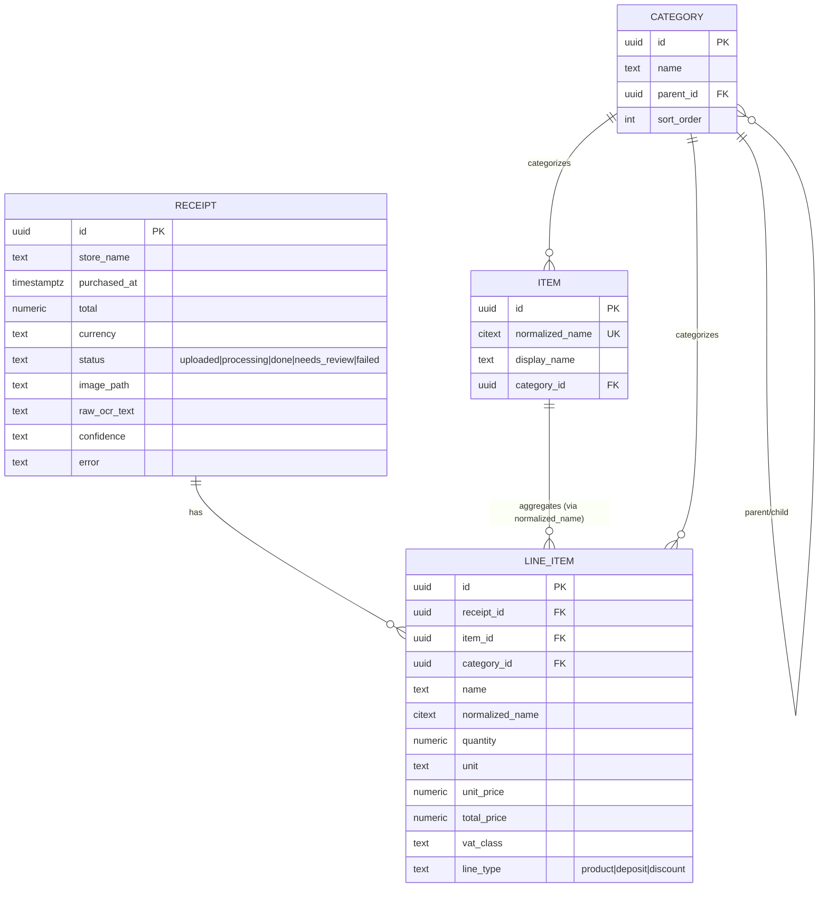
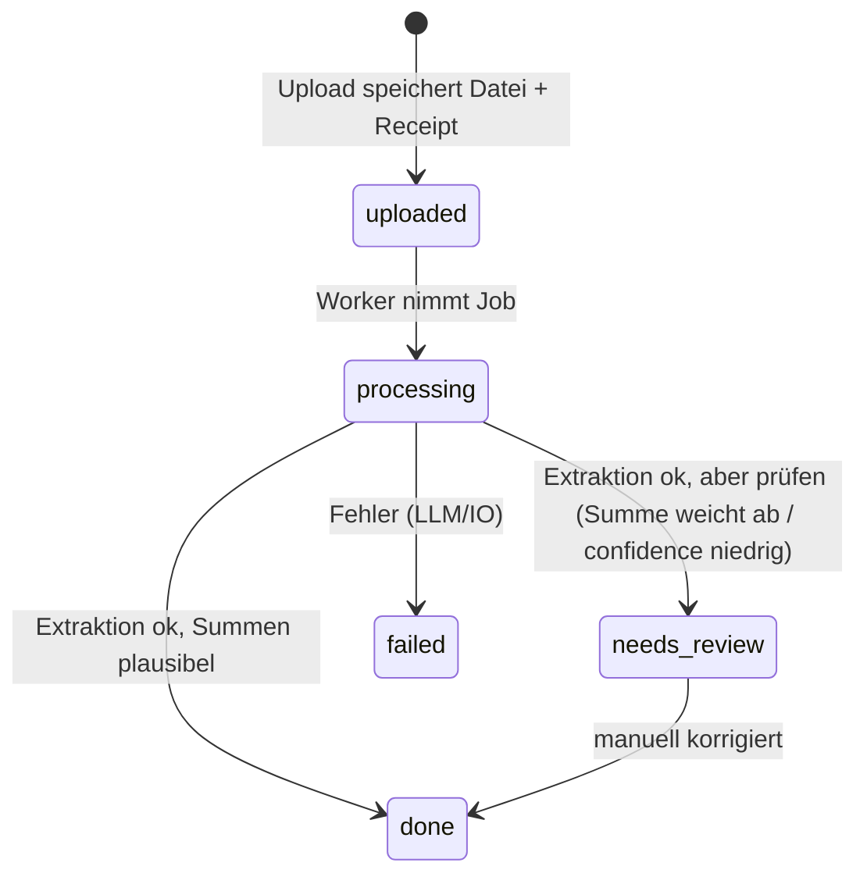

# Architektur

Quelle der Wahrheit für das *Wie*. Wer Datenmodell, Hintergrundjobs oder eine
Architekturentscheidung ändert, pflegt diese Datei in derselben Änderung.

## 1. Überblick

- **Backend:** FastAPI, SQLAlchemy 2 (async), PostgreSQL 16, Alembic. Async
  Extraktion über einen ARQ-Worker + Redis (ab Phase 2).
- **Frontend:** Nuxt 3 SPA (`ssr: false`), TypeScript strict, Pinia, Tailwind, PWA.
- **LLM:** provider-agnostischer Adapter (`integrations/llm/`), Default
  OpenAI-Vision-kompatibel, umschaltbar auf Ollama per ENV.
- **Betrieb:** docker-compose (db, redis, backend, worker, frontend).

### 1.1 Schichten & die eine harte Regel

`domain/` importiert **nichts** aus `services/`, `integrations/` oder `api/`.
Es ist reine, synchrone, I/O-freie Logik (Normalisierung, später Aggregation)
und dort konzentrieren sich die Unit-Tests. Alles mit DB-, Netz- oder
Redis-Zugriff gehört in `services/` bzw. `integrations/`.

`services/` orchestriert Use-Cases. `integrations/` kapselt jede Außenwelt
hinter einem Interface, damit Anbieter austauschbar bleiben (LLM: openai /
ollama / null-Fallback; Storage).

## 2. Datenmodell

UUID-v7-Primärschlüssel (zeitlich sortiert), `created_at`/`updated_at` per
Mixin. Geldbeträge als `Numeric` (keine Floats). Enums als Text-Spalte mit
`CHECK`-Constraint. Produktnamen für den Abgleich als `CITEXT`.

### 2.1 Receipt-Statusfluss

Das Frontend pollt den Receipt (~2 s), bis `processing` verlassen ist
(Entscheidung: Polling statt WebSocket — das Backend bleibt zustandslos).

### 2.2 Normalisierung (`domain/normalize.py`)

Der Schlüssel für Vergleichbarkeit über Bons und Zeit: `normalize_name`
faltet Groß/Klein, Umlaute/ß, Akzente, Dezimal-Komma und Satzzeichen zu einem
stabilen Key. „H-Milch 3,5%", „H MILCH 3.5" und „h.milch 3,5 %" ergeben denselben
`normalized_name`. `LineItem.normalized_name` und `Item.normalized_name` nutzen
dieselbe Funktion; darüber mappen Positionen auf das `Item`-Stammdatum für
Trends. Bewusst einfach — ein klügerer Matcher kann später aufsetzen, ohne den
Vertrag zu ändern.

## 3. Extraktions-Pipeline (Phase 2)

1. Upload speichert Datei (SSRF-/Typ-gehärtet, server-generierter Dateiname) und
   legt `Receipt` mit `status=uploaded` an.
2. Ein ARQ-Job schickt das Bild an das Vision-LLM mit dem Prompt aus
   `prompts/receipt_extraction.de.txt` (striktes JSON-Schema).
3. Ergebnis → `Receipt` + `LineItem`s, Positionen bekommen `normalized_name` und
   werden auf `Item` gemappt; `status=done`. Bei Parsing-/Summenproblemen
   `needs_review`, bei Fehlern `failed`.
4. Jeder LLM-Pfad degradiert sauber auf den Regel-/No-op-Fallback
   (`LLM_PROVIDER=none`).

## 4. Analyse-Ebene (Phase 4, das Herzstück)

Aggregations-Queries + Endpoints (Details siehe
[Anforderungen](anforderungen.md)): Monatsbericht, „zu viel gekauft", „teure
Lebensmittel", Preistrend pro Artikel, Vormonatsvergleich. Die reine
Aggregationslogik lebt in `domain/` und ist der Testschwerpunkt.

## 5. Offene Entscheidungen

- Auth: für Phase 1 bewusst weggelassen (privates Homelab). Magic-Link-Login
  (an cooking-jonelli orientiert) ist als späterer, optionaler Baustein
  vorgesehen.
- Kategorie-Hierarchie: aktuell zweistufig geseedet (Top-Level = die vom Prompt
  vergebenen Kategorien, plus einige Unterkategorien). Tiefe bleibt offen.
