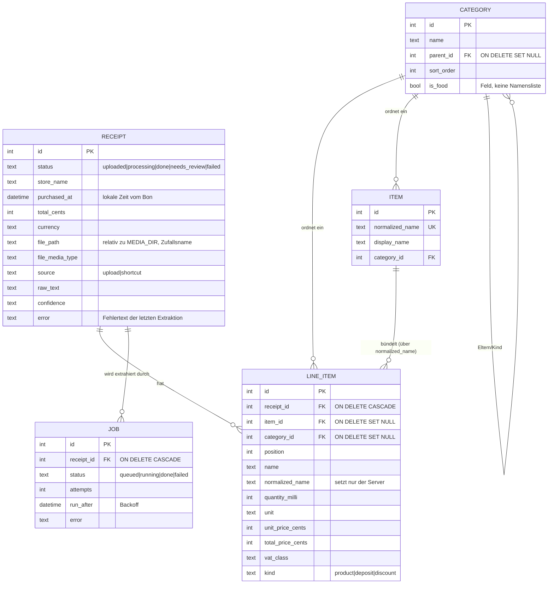
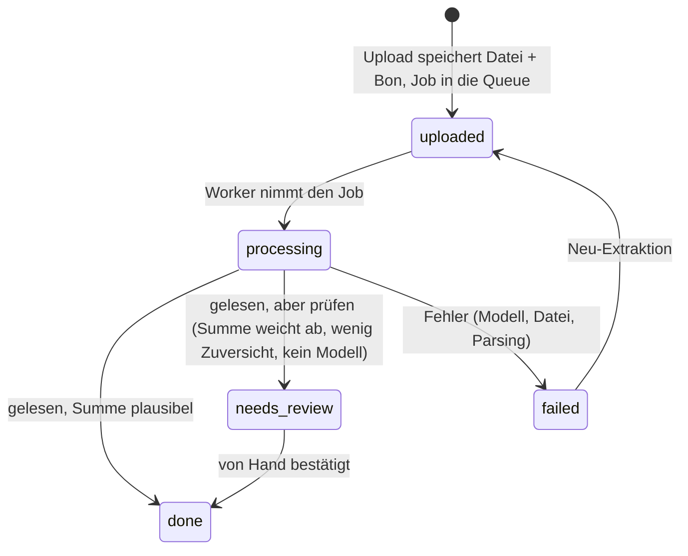

# Architektur

Quelle der Wahrheit für das *Wie*. Wer Datenmodell, Hintergrundverarbeitung oder
eine Architekturentscheidung ändert, pflegt diese Datei in derselben Änderung.
Begründungen stehen in [`entscheidungen.md`](entscheidungen.md).

## 1. Überblick

**Ein Prozess, ein Container, eine Datei.**

```
┌─────────────────────── Container ────────────────────────┐
│  uvicorn (1 Worker)                                      │
│                                                          │
│   FastAPI ── /api/*  ──► Routen ──► Services ──► SQLite  │
│      │                       │                  (WAL)    │
│      └── /*  ──► SPA (statisch, gebaut mit Vite)         │
│                              │                           │
│   asyncio-Task: Worker ◄─────┘  jobs-Tabelle             │
│      └──► Vision-LLM (optional, HTTP)                    │
└──────────────────────────────────────────────────────────┘
        Volume /data:  haushalt.db  +  belege/JJJJ/MM/*
```

* **Backend:** FastAPI, SQLAlchemy 2 (async) auf SQLite via `aiosqlite`, Alembic.
* **Frontend:** Vite + Vue 3 + TypeScript, vue-router, PWA. Kein Nuxt, kein
  Tailwind, keine Chart-Bibliothek, kein Pinia.
* **Extraktion:** DB-gestützte Queue plus asyncio-Worker **im selben Prozess**.
* **Betrieb:** ein Dienst in `docker-compose.yml`, ein Volume.

### 1.1 Schichten und die eine harte Regel

`domain/` importiert **nichts** aus `services/`, `integrations/` oder `api/`.
Es ist reine, synchrone, I/O-freie Logik — Geldarithmetik, Normalisierung,
Bon-Parser, alle Aggregationen. Dort konzentrieren sich die Unit-Tests.

`services/` orchestriert Anwendungsfälle (Datenbank, Dateien, Queue).
`integrations/` kapselt jede Außenwelt hinter einem Interface, damit Anbieter
austauschbar bleiben (LLM: openai / openrouter / ollama / none; Dateiablage;
PDF- und Bildaufbereitung).

| Verzeichnis | Inhalt | Darf importieren |
| --- | --- | --- |
| `domain/` | money, normalize, extraction, aggregation | nur `domain/` |
| `services/` | receipts, extraction, analytics, categories, items, jobs, tokens | `domain/`, `integrations/`, `models/` |
| `integrations/` | llm/, files, documents | `domain/`, `core/` |
| `api/` | deps, routes/ | alles darunter |

## 2. Datenmodell

Ganzzahlige Primärschlüssel ([ADR-008](entscheidungen.md#adr-008)). Beträge als
`INTEGER` in **Cent**, Mengen als `INTEGER` in **Tausendstel**
([ADR-003](entscheidungen.md#adr-003)). Aufzählungen als Textspalte mit
`CHECK`-Constraint.



`api_tokens` steht daneben (kein Bezug): `name`, `token_hash` (SHA-256),
`last_used_at`.

**Fremdschlüssel gelten nur mit `PRAGMA foreign_keys=ON`** — SQLite ignoriert sie
sonst stillschweigend, und `ON DELETE CASCADE` an `line_items` täte nichts. Das
Pragma setzt `db/session.py` pro Verbindung, zusammen mit `journal_mode=WAL`,
`synchronous=NORMAL` und `busy_timeout=5000`.

### 2.1 Statusfluss



Nur `done` und `needs_review` gehen in die Auswertung ein. Ein ungeprüfter Bon
zählt **mit** — ihn auszublenden würde einen ganzen Einkauf aus dem Monatstotal
nehmen und den Bericht stillschweigend zu niedrig machen. Stattdessen liefert
`/analytics/monthly` ein `unreviewed_count`, mit dem die UI daran erinnert.

### 2.2 Normalisierung — der Trend-Anker

`domain/normalize.normalize_name` faltet Groß-/Kleinschreibung, Umlaute, ß,
Akzente, Dezimalkomma und Satzzeichen zu einem stabilen Schlüssel: „H-Milch
3,5 %“, „H MILCH 3.5“ und „h.milch 3,5%“ ergeben denselben Wert. Darüber mappen
Positionen auf `Item` — das ist die Voraussetzung dafür, dass es überhaupt
Preisverläufe gibt.

`services/items.apply_product_mapping` ist die **einzige** Stelle, die
`normalized_name` und `item_id` setzt. Extraktion und manuelle Korrektur laufen
beide hierdurch; der Client setzt diese Felder nie. Pfand- und Rabattpositionen
bekommen kein Stammdatum, sonst stünde „PFAND 0,25“ im Artikelkatalog.

## 3. Extraktion

### 3.1 Queue und Worker

Eine `jobs`-Tabelle plus ein asyncio-Task im API-Prozess
([ADR-002](entscheidungen.md#adr-002)):

1. `POST /api/receipts` prüft Größe und Typ (**Magic Bytes**, nicht der
   Client-`Content-Type`), legt die Datei unter einem Zufallsnamen ab, erstellt
   den Bon mit `status=uploaded` und einen Job — dann `commit`, **dann** wecken.
2. `services/jobs.claim_next` setzt den nächsten fälligen Job atomar auf
   `running` (`UPDATE … WHERE status='queued'` als Absicherung).
3. `services/extraction.process_receipt` wählt den Weg (siehe 3.2) und schreibt
   das Ergebnis.
4. Fehler → `mark_failed`: unter `WORKER_MAX_ATTEMPTS` erneut mit linearem
   Backoff, sonst `failed`. Der Fehlertext landet am Bon.
5. Beim Start werden in `running` hängende Jobs requeued — Crash-Recovery.

Der Worker wartet auf ein `asyncio.Event` (Upload weckt sofort) und wacht nach
`WORKER_IDLE_SECONDS` von selbst auf, um abgelaufene Backoffs aufzunehmen. Die
Schleife fängt jede Ausnahme: sie darf nie sterben, sonst würde stillschweigend
nichts mehr extrahiert.

### 3.2 Die drei Wege

| Eingabe | Weg | Modell nötig |
| --- | --- | --- |
| Text-PDF (digitaler eBon) | `documents.extract_pdf_text` → `domain/extraction.parse_receipt_text` | nein |
| Foto, gescanntes PDF | Bild aufbereiten → Vision-Adapter → `parse_receipt_json` | ja |
| Foto ohne konfiguriertes Modell | `needs_review` mit Hinweis | nein |

Der Textparser erkennt Artikelzeilen (mit MwSt-Buchstaben), Mengenzeilen
(`0,780 kg x 1,77`), Lidls Inline-Menge (`0,29 x 6`), Pfand, Rabatte und die
Summenzeile mehrerer Ketten. Nur Zeilen **oberhalb** der Summe gelten als
Artikel, damit Zahlart und Fußzeile draußen bleiben.

Bilder gehen durch `documents.prepare_image_for_llm`: EXIF-Rotation anwenden
(ein hochkant fotografierter Bon liegt sonst quer), auf `LLM_MAX_IMAGE_PX`
verkleinern, als JPEG kodieren. HEIC (iPhone-Standard) wird dabei umgewandelt,
weil die meisten Vision-APIs es nicht annehmen.

`domain/extraction.reconcile` vergleicht die Positionssumme mit der gedruckten
Endsumme (Toleranz: 2 Cent oder 1 %). Passt sie nicht — oder meldete das Modell
wenig Zuversicht, oder gibt es keine Positionen — dann `needs_review`.

### 3.3 Beobachtbarkeit

Logs gehen strukturiert nach stdout, also in `docker logs`. Es gibt keinen
Log-Ring und keine Admin-Log-Ansicht: der Fehlertext einer Extraktion steht am
Bon, wo man ihn sucht, und `GET /api/health` nennt Version, Auth-Modus,
Modellbereitschaft und Länge der Warteschlange.

## 4. Auswertung

`services/analytics` holt die relevanten Positionen als flache `PurchaseRecord`s
(Join `line_items` × `receipts` × `categories`, Zeitfenster über
`coalesce(purchased_at, created_at)`). Die **reine** Rechenlogik liegt in
`domain/aggregation` und ist der Testschwerpunkt.

| Endpoint | Inhalt |
| --- | --- |
| `GET /api/analytics/monthly` | Gesamt, Produkt/Pfand/Rabatt, Lebensmittelsumme, Bon-Anzahl, ungeprüfte Bons, Kategorien (mit Anteil), Märkte, teuerste Einzelpositionen |
| `GET /api/analytics/items?sort=` | Artikel-Ranking: `spend`, `frequency` oder `unit_price`, mit Anteil am Lebensmittelbudget |
| `GET /api/analytics/price-trend/{item_id}?months=` | Ø-Stückpreis pro Tag über mehrere Monate |
| `GET /api/analytics/compare` | Vormonatsvergleich, gesamt und je Kategorie |

Ein Endpoint mit `sort=` statt zwei getrennten: „was kaufe ich zu oft“, „teure
Lebensmittel“ und „teuerster Stückpreis“ sind dieselbe Auswertung in drei
Sortierungen.

`is_food` kommt als Flag am Record aus `categories.is_food`
([ADR-007](entscheidungen.md#adr-007)) — nicht aus einer Namensliste im Code, die
beim Umbenennen einer Kategorie stillschweigend falsch wurde.

## 5. Auth

Eine Stelle erzeugt Identität: `api/deps.require_auth`. Reihenfolge:

1. **API-Token** im `Authorization: Bearer`-Header (iOS-Kurzbefehl).
2. **Session-Cookie** aus dem Passwort-Login (HMAC über `subject|ablauf`,
   httpOnly, SameSite=Lax).
3. **Vertrauter Header** vom Reverse Proxy (nur `AUTH_MODE=trusted_header`).

Der Login ist prozesslokal rate-limitiert; das Passwort wird per
`hmac.compare_digest` in konstanter Zeit verglichen. Es gibt keine
`users`-Tabelle ([ADR-004](entscheidungen.md#adr-004)).

`GET /api/health` ist absichtlich offen, damit der Docker-Healthcheck ihn
erreicht; er verrät nichts Vertrauliches.

## 6. Frontend

Aufbaureihenfolge war Tokens → Primitives → Charts → Shell → Seiten
([ADR-011](entscheidungen.md#adr-011)). Die umgekehrte Reihenfolge erzeugte im
Altstand die 30-fach wiederholte Utility-Kette.

* **`styles/tokens.css`** ist die einzige Datei mit Farbwerten, je für Light und
  Dark. Der Dark Mode folgt `prefers-color-scheme`, eine ausdrückliche Wahl
  (`data-theme`) gewinnt.
* **`ui/`** enthält die Primitives. `UiMoneyInput` hat **Cent** als Modell —
  damit gibt es an der Eingabegrenze keinen Weg zu einer Fließkommazahl.
* **`charts/`** ist handgeschriebenes SVG ([ADR-009](entscheidungen.md#adr-009)):
  Donut, Linie mit Achsen und Hover, Ranking-Balken. Sie nutzen dieselben Tokens
  und funktionieren im Dark Mode automatisch mit.
* **`lib/useResource.ts`** ist der Kern der Ladearchitektur: **eine Ressource pro
  Widget**, mit eigenem Skeleton, Fehlerzustand und Wiederholen-Knopf. Läufe
  werden durchgezählt, damit eine langsame alte Antwort keine neue überschreibt.
  Kein `Promise.all`, das eine Seite mitreißt.
* **`lib/money.ts`** ist die einzige Stelle, die aus Cent Text macht — und
  umgekehrt, mit Ganzzahl-Arithmetik statt `parseFloat`.
* **Navigation:** Sidebar auf Desktop (ab 900 px), Bottom-Navigation plus
  Kamera-Knopf auf Mobil.

## 7. Ausliefern und Betrieb

Ein Multi-Stage-Dockerfile: Stage 1 baut die SPA nach `backend/app/static`,
Stage 2 ist eine Python-Runtime, die API und statische Dateien bedient.
`_mount_spa` registriert den Fallback **nach** den `/api`-Routen; ein unbekannter
`/api`-Pfad liefert bewusst 404 statt `index.html`, damit ein API-Client nicht
plötzlich HTML bekommt.

Beim Start: Migrationen anwenden → Kategorien seeden → Worker starten. Es gibt
keinen `migrate`-Container und keine Startreihenfolge.

Deploy ist `docker compose pull && docker compose up -d`. Backup ist eine Kopie
von `/data`.

**Genau ein uvicorn-Worker.** SQLite hat einen Schreiber, und der
Extraktions-Worker läuft im selben Prozess — mehrere Worker würden denselben Bon
mehrfach extrahieren.

## 8. Tests

| Ebene | Umfang | Braucht |
| --- | --- | --- |
| `tests/unit/` | Geld, Normalisierung, beide Extraktionswege, alle Aggregationen, Session/Rate-Limit | nichts |
| `tests/integration/` | ganze API gegen temporäre SQLite-Datei, Pipeline mit Fake-Modell | nichts |
| `frontend/tests/` | Geld/Format-Logik, Komponenten (Ressourcengrenze, Geldfeld, Charts) | nichts |

Kein Test braucht Postgres, Redis, Docker oder einen freien Port
([ADR-010](entscheidungen.md#adr-010)). Die Fixtures setzen ihre Umgebung
**explizit** statt per `setdefault` — genau dieser Unterschied ließ im Altstand
`make check` an einem Port-Widerspruch scheitern.
